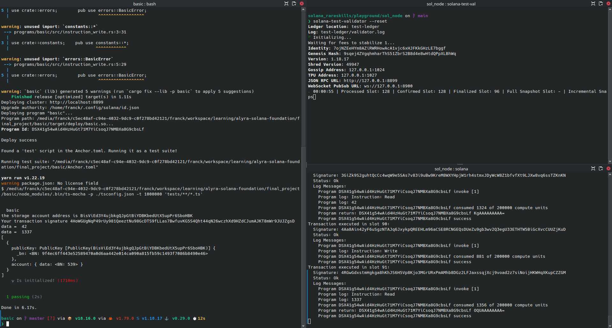

# Basic storage

## Overview

Example of an **Anchor project** well-structured like a boss !

**Sources :**
- [An intuitive way of structuring your Solana program](https://0xksure.medium.com/an-intuitive-way-of-structuring-your-solana-program-43c371007152)
- [sure-v1/programs/oracle/src at main · Sure-Protocol/sure-v1 · GitHub](https://github.com/Sure-Protocol/sure-v1/tree/main/programs/oracle/src)


## Repository tree

```
.
├── app
├── migrations
│   └── deploy.ts
├── programs
│   └── basic
│       ├── src
│       │   ├── instructions
│       │   │   ├── initialize.rs
│       │   │   ├── mod.rs
│       │   │   ├── read.rs
│       │   │   └── write.rs
│       │   ├── constants.rs
│       │   ├── errors.rs
│       │   ├── lib.rs
│       │   └── states.rs
│       ├── Cargo.toml
│       └── Xargo.toml
├── tests
│   └── basic.ts
├── Anchor.toml
├── Cargo.lock
├── Cargo.toml
├── deploy_local_test.png
├── package.json
├── README.md
├── tsconfig.json
└── yarn.lock
``` 

## Launch



### Local validator

`solana-test-validator --reset`

Beware it creates local files and directories at the current working directory.


### Real-time logs display

`solana logs`


### Deploy and launch tests

`anchor test --skip-local-validator`

Just check if read/write instructions works.
Display all account(s) bind to program (`await program.account.myStorage.all()`)